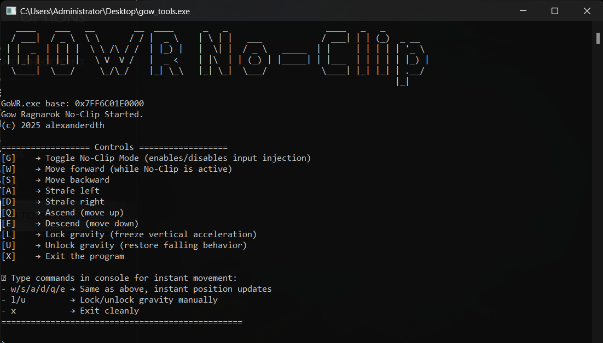
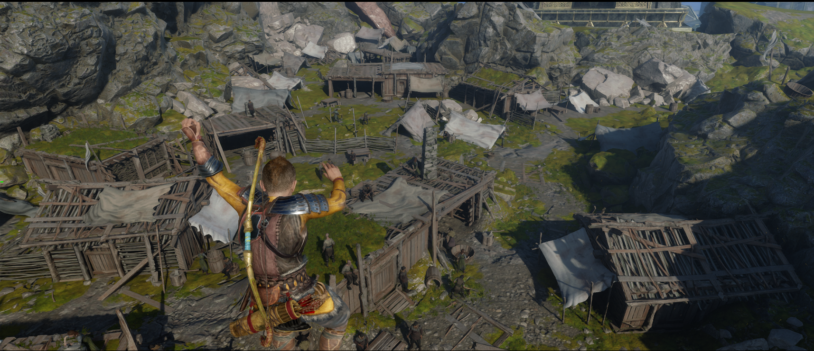
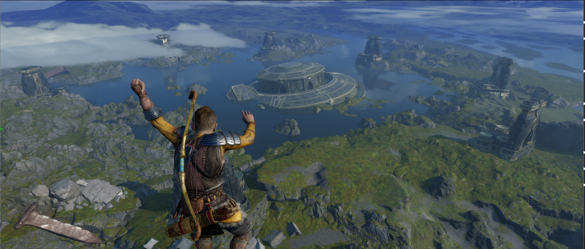

# GoWR No-Clip Tool

A Rust-based no-clip movement tool for *God of War: Ragnarok* (PC).  
This tool allows you to manipulate Kratos' position and gravity in real-time by writing directly to memory.

> I built this to teach myself how to reverse engineer memory and control game state using Rust.  
> Everyone's doing this in C++ — Rust deserves some love too, man.

---

## ✨ Features

- ✅ **W / A / S / D** – Move Kratos forward, left, back, right (camera-relative)
- ✅ **Q / E** – Move up / down vertically
- ✅ **G** – Toggle No-Clip Mode (enables or disables live input injection)
- ✅ **L** – Lock gravity (prevents falling by freezing vertical acceleration)
- ✅ **U** – Unlock gravity (restores default falling behavior)
- ✅ **Target height lock** – Maintains Y position while flying
- ✅ **Command console** – Type commands like `w`, `q`, `e`, `l`, `u`, `x` directly
- ✅ **Atomic threading** – Clean and responsive real-time control
- ✅ Built with `libmem` (by [rdbo](https://github.com/rdbo/libmem)) for memory editing

---

## 🖥️ Console Commands

While running the app, you can also type commands into the terminal:

| Command | Description                         |
|---------|-------------------------------------|
| `w/s/a/d` | Move instantly (same as hotkeys)  |
| `q/e`     | Adjust height up/down             |
| `l/u`     | Lock or unlock gravity            |
| `x`       | Exit the program                  |

---

## Screenshots




## 🛠 Dependencies

- [`libmem`](https://github.com/rdbo/libmem) – Rust memory editing abstraction
- [`device_query`](https://crates.io/crates/device_query) – Key input handling
- [`figlet-rs`](https://crates.io/crates/figlet-rs) – ASCII banner

---
## 🚀 Build Instructions

Make sure you have Rust installed:  
https://www.rust-lang.org/tools/install

Then build the project:

```bash
cargo build --release
